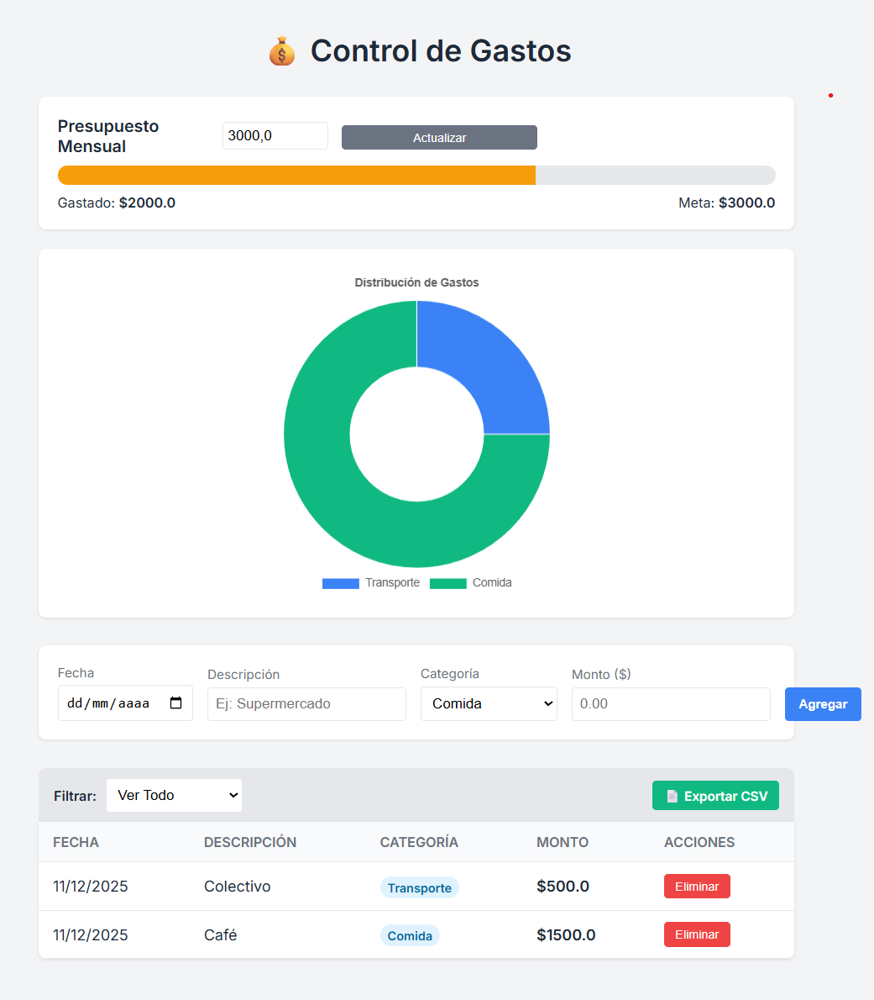

# Flask Expense Tracker 💰📊

Una aplicación web completa para la gestión de finanzas personales. Permite registrar gastos, visualizar métricas en tiempo real con gráficos interactivos, establecer presupuestos mensuales y exportar reportes.

Este proyecto Full Stack demuestra la integración de **Python (Flask)** con un frontend dinámico, manejo de base de datos SQL y lógica de negocio avanzada.

## ✨ Características Principales

* **Dashboard Interactivo:** Visualización de gastos por categoría mediante gráficos de rosquilla (Doughnut Charts) con **Chart.js**.
* **Gestión de Presupuesto:** Establecimiento de metas mensuales con una barra de progreso que cambia de color según el porcentaje gastado (Semáforo: Verde/Amarillo/Rojo).
* **CRUD de Gastos:** Registro detallado (Fecha, Descripción, Categoría, Monto) y eliminación de registros.
* **Filtros Inteligentes:** Visualización histórica o filtrada por Mes y Año específico.
* **Sincronización Total:** El gráfico y la tabla se actualizan automáticamente según los filtros aplicados.
* **Exportación de Datos:** Generación de reportes CSV compatibles con Excel, respetando los filtros activos.
* **Feedback de Usuario:** Notificaciones visuales (Flash Messages) para confirmar acciones o errores.

## 📸 Captura de Pantalla

### Vista General del Dashboard
Panel de control completo que integra el estado del presupuesto, gráficos interactivos, formulario de carga y el listado de gastos filtrable.


## 🛠️ Tecnologías Utilizadas

* **Backend:** Python 3.10+, Flask.
* **Base de Datos:** SQLite, SQLAlchemy (ORM).
* **Frontend:** HTML5, CSS3 (Diseño Responsivo), Jinja2 Templates.
* **JavaScript:** Fetch API (Consumo de datos), Chart.js (Gráficos).
* **Herramientas:** Git, Virtualenv.

## ⚙️ Instalación y Ejecución

Sigue estos pasos para correr el proyecto localmente:

### 1. Clonar el repositorio

```bash
git clone [https://github.com/ryakimovicz/flask-expense-tracker.git](https://github.com/ryakimovicz/flask-expense-tracker.git)
cd flask-expense-tracker
```

### 2. Configurar entorno virtual e instalar dependencias

```bash
python -m venv venv
# Windows:
.\venv\Scripts\activate
# Mac/Linux:
source venv/bin/activate

pip install -r requirements.txt
```

### 3. Ejecutar la aplicación

```bash
python app.py
```

La aplicación correrá en `http://127.0.0.1:5000`. La base de datos se creará automáticamente en la carpeta `instance/`.

## 📂 Estructura del Proyecto

```text
flask-expense-tracker/
├── app.py              # Lógica del servidor, rutas y modelos DB
├── instance/           # Base de datos SQLite (no se sube a Git)
├── static/
│   ├── css/            # Estilos personalizados
│   └── js/             # Lógica del gráfico (Chart.js)
├── templates/
│   └── index.html      # Interfaz de usuario (Jinja2)
└── requirements.txt    # Dependencias del proyecto
```

---
**Autor:** Román Yakimovicz  
Desarrollado como parte de mi portfolio de programación.

💼 **LinkedIn:** [linkedin.com/in/ryakimovicz](https://www.linkedin.com/in/ryakimovicz/)  
🐙 **GitHub:** [@ryakimovicz](https://github.com/ryakimovicz)  
📧 **Email:** [ryakimovicz@gmail.com](mailto:ryakimovicz@gmail.com)